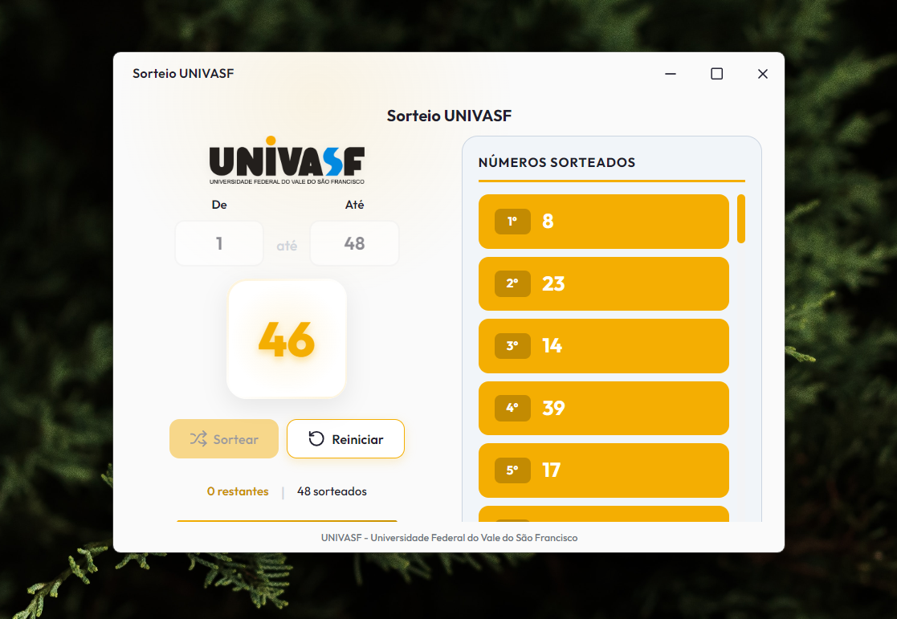

# Sorteio UNIVASF


Aplicativo desktop para sorteio de números, (UNIVASF).


## 📋 Descrição

Desenvolvida inicialmente para atender a uma demanda acadêmica da turma de História da UNIVASF, com o objetivo de organizar e automatizar o sorteio de participantes para debates em sala, garantindo imparcialidade e agilidade no processo.

### ✨ Funcionalidades

- **Sorteio de Números**: Define um intervalo mínimo e máximo para os números a serem sorteados
- **Efeitos Sonoros**:
  - Efeito sonoro de roleta durante o sorteio
  - Som de seleção ao marcar números como concluídos
- **Marcação de Números**: Clique nos números sorteados para marcá-los como concluídos
- **Lista Ordenada**: Exibe os números na ordem em que foram sorteados (1°, 2°, 3°...)
- **Barra de Progresso**: Mostra o progresso do sorteio
- **Funciona Offline**: Todos os recursos são locais, não requer conexão com a internet


## 🖥️ Tecnologias

| Tecnologia | Versão | Propósito |
|------------|--------|-----------|
| Electron | 30.0.1 | Framework desktop |
| React | 18.2 | Biblioteca UI |
| TypeScript | 5.2 | Linguagem tipada |
| Vite | 5.1 | Bundler |
| Lucide React | 1.7 | Ícones |
| electron-builder | 24.13 | Empacotamento |

## 📁 Estrutura do Projeto

```
sorteio/
├── electron/                 # Processo principal do Electron
│   ├── main.ts             # Entry point do Electron
│   └── preload.ts          # Script de preload (IPC bridge)
├── public/                  # Arquivos estáticos
│   ├── icone.ico          # Ícone do aplicativo
│   ├── logo.png           # Logo UNIVASF
│   ├── song.mp3           # Música do sorteio
│   └── select.mp3         # Som de seleção
├── src/
│   ├── assets/
│   │   └── fonts/         # Fontes locais (Outfit)
│   ├── components/         # Componentes React
│   │   ├── Button.tsx     # Botão reutilizável
│   │   ├── DrawnNumbers.tsx # Lista de números sorteados
│   │   ├── Logo.tsx       # Logo UNIVASF
│   │   ├── RangeInput.tsx  # Inputs de range min/max
│   │   ├── SlotMachine.tsx # Display do número atual
│   │   ├── StatusBar.tsx  # Barra de progresso
│   │   └── TitleBar.tsx   # Barra de título customizada
│   ├── hooks/              # Custom hooks
│   │   └── useSorteio.ts  # Lógica principal do sorteio
│   ├── App.tsx             # Componente principal
│   ├── App.css             # Estilos do App
│   ├── index.css           # Estilos globais e variáveis CSS
│   └── main.tsx           # Entry point React
├── dist/                   # Build de produção (renderer)
├── dist-electron/           # Build de produção (electron)
├── release/                 # Executáveis gerados
├── electron-builder.json5  # Configuração do electron-builder
├── index.html              # HTML entry
├── package.json            # Dependências e scripts
├── tsconfig.json           # Configuração TypeScript
├── vite.config.ts          # Configuração Vite
└── README.md              # Este arquivo
```

## 📖 Como Usar

1. **Definir Intervalo**: No campo "De" insira o número mínimo e em "Até" o número máximo
2. **Sortear**: Clique no botão "Sortear" para iniciar o sorteio
3. **Animação**: Os números passarão rapidamente na tela durante aproximadamente 5 segundos
4. **Resultado**: Ao final, todos os números aparecem na lista à direita na ordem sorteada
5. **Marcar**: Clique em qualquer número da lista para marcá-lo como concluído
6. **Reiniciar**: Clique em "Reiniciar" para limpar e fazer um novo sorteio


## 📝 Estados do Sorteio

| Estado | Descrição |
|--------|-----------|
| `min` | Número mínimo do intervalo |
| `max` | Número máximo do intervalo |
| `drawnNumbers` | Array de objetos `{number, order}` com números sorteados |
| `currentNumber` | Número sendo exibido na slot machine |
| `isSpinning` | Se está em animação |
| `isFinished` | Se todos os números foram sorteados |
| `concludedNumbers` | Array de números marcados como concluídos |

## 📄 Licença

Este projeto é de codigo aberto e licensa MIT.

## 👨‍💻 Autor

João M J Braga
- Email: joomdeveloper.app@gmail.com

